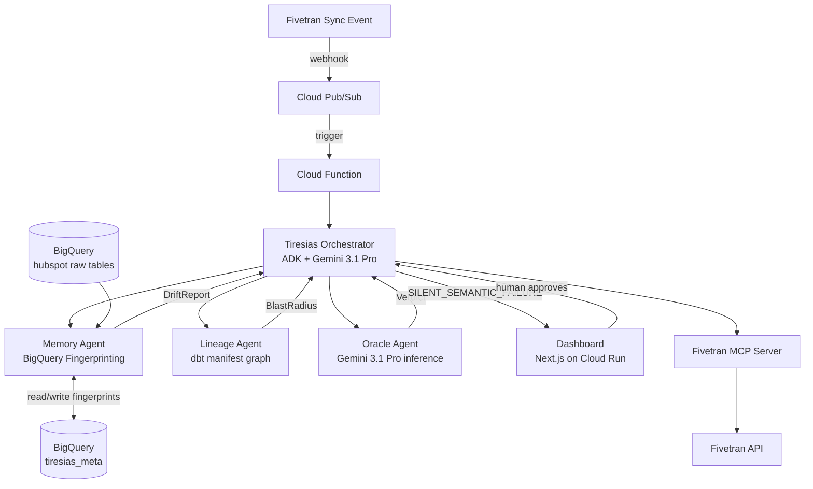

# Tiresias — The Pre-Cognitive Data Quality Agent

> *"The pipeline is green. The data is wrong."*

Fivetran's 2026 State of the Data Pipeline report found that large enterprises face **$3M/month in pipeline-failure exposure**, with engineers spending **53% of their time maintaining pipelines** — yet most monitoring tools only alert when something technically breaks. They cannot see silent failures: schema drifts, broken joins, and distribution shifts that downstream dashboards consume as truth while every sync succeeds and every dbt run passes.

Tiresias is a multi-agent system that detects those invisible failures before the VP of Sales discovers them in a board meeting.

Named after the blind prophet of Greek myth who could see what others could not.

---

## What Tiresias does

A Fivetran sync completes. Nothing breaks. But the source system quietly renamed a deal stage. Downstream, a dbt model filters on a string literal that no longer exists. The "Late Stage Pipeline" KPI silently returns $0. No alert fires.

Tiresias catches it — in seconds, before any human reads a dashboard.

```
Fivetran sync completed
        │
        ▼
Memory: fingerprint the synced table
  → PSI spike on dealstage column (1.87 vs threshold 0.25)
  → "Contract Sent" absent from distribution; "Contract Under Review" present at same frequency
        │
        ▼
Lineage: trace the blast radius
  → hubspot.deal → stg_deals → fct_pipeline_by_stage → "Late Stage Pipeline" dashboard → VP of Sales
        │
        ▼
Oracle (Gemini 3.1 Pro): classify the drift
  → SILENT_SEMANTIC_FAILURE, 94% confidence
  → "Downstream models using string-literal equality on 'Contract Sent' will silently return empty result sets"
        │
        ▼
Tiresias: propose a fix, wait for human approval
  → Human approves in the dashboard
  → Fivetran MCP executes: sync_connection to confirm state
        │
        ▼
Audit log records every decision
```

---

## Architecture



### Agents

| Agent | File | Role |
|---|---|---|
| **Tiresias** | `backend/tiresias/orchestrator.py` | Top-level orchestrator; owns the decision loop |
| **Memory** | `backend/memory/fingerprint.py` | Statistical fingerprinting; computes and compares table profiles |
| **Oracle** | `backend/oracle/inference.py` | Gemini 3.1 Pro inference; classifies drift type |
| **Lineage** | `backend/lineage/graph.py` | Parses dbt manifest; traces downstream blast radius |

---

## Tech stack

- **Brain:** Gemini 3.1 Pro via Vertex AI (Google Gen AI SDK)
- **Orchestration:** Google Cloud Agent Builder + Agent Development Kit (Python)
- **Partner integration:** Fivetran MCP server (4 tools: `list_connections`, `get_connection_schema_config`, `modify_connection_table_config`, `sync_connection`)
- **Data warehouse:** BigQuery (`tiresias-496915` project, `hubspot` dataset for raw tables, `tiresias_meta` for agent state)
- **Backend:** Python 3.11, FastAPI
- **Frontend:** Next.js 14 App Router, TypeScript, Tailwind CSS, shadcn/ui, React Flow, Framer Motion
- **Stats:** scipy/numpy — PSI, Z-score, schema delta
- **Lineage:** networkx + dbt Quickstart manifest.json

---

## Quick start

```bash
# 1. Clone and set up environment
git clone https://github.com/YOUR_USERNAME/tiresias
cd tiresias
cp .env.example .env
# Fill in .env — see comments in that file

# 2. Install dependencies
cd backend && pip install -r requirements.txt
cd ../frontend && npm install

# 3. Set up GCP resources
bash infra/setup.sh

# 4. Start everything
make dev
```

### Prerequisites

- Python 3.11+
- Node.js 18+
- Google Cloud SDK (`gcloud`) authenticated
- Fivetran account with HubSpot connector syncing to BigQuery
- Git Bash or WSL on Windows (Makefile uses bash syntax)

---

## Environment variables

See `.env.example` for all required variables with descriptions.

---

## Demo scenario

The demo uses a seeded HubSpot account with 100 deals across 7 pipeline stages. 18 deals in "Contract Sent" represent **$2.56M** in late-stage pipeline.

The silent failure: sales ops renames the stage "Contract Sent" → "Contract Under Review". Fivetran syncs. Nothing errors. Tiresias fires.

```bash
# Seed the demo state (run once after importing the CSV data to HubSpot)
python scripts/seed_demo.py

# Trigger the silent failure (uses real HubSpot API + Fivetran sync for the demo)
python scripts/trigger_failure.py --mode authentic
```

---

## Status

**Session 1 — In progress**

| Phase | Status | Notes |
|---|---|---|
| Phase 0: Scaffold | ✅ Complete | Monorepo, env, Makefile, pre-commit |
| Phase 1: Memory | 🔄 In progress | Fingerprinting against synthetic baseline; real sync data incoming |
| Phase 2: Lineage | ⏳ Session 2 | Will use real Fivetran Quickstart dbt manifest |
| Phase 3: Oracle | ⏳ Session 2 | |
| Phase 4: Orchestrator + MCP | ⏳ Session 3 | |
| Phase 5: Frontend | ⏳ Session 4 | |
| Phase 6: Demo polish | ⏳ Session 5 | |
| Phase 7: Submission | ⏳ Session 5 | |

**Blocked:** None.
**Next:** Complete Memory fingerprinting, point at real synced HubSpot data once first sync completes.
